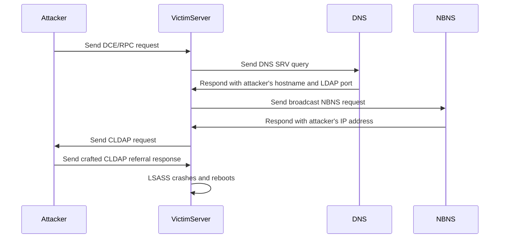
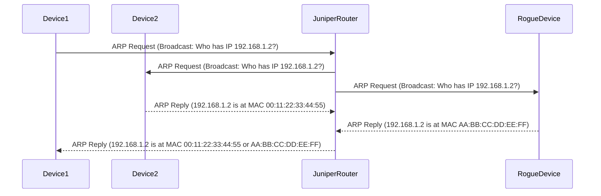

# Flows For CVEs
- CVE-2024-49112\[3\]

```mermaid
sequenceDiagram
    participant Attacker
    participant VictimServer
    participant DNS
    participant NBNS

    Attacker->>VictimServer: Send DCE/RPC request
    VictimServer->>DNS: Send DNS SRV query
    DNS->>VictimServer: Respond with attacker's hostname and LDAP port
    VictimServer->>NBNS: Send broadcast NBNS request
    NBNS->>VictimServer: Respond with attacker's IP address
    VictimServer->>Attacker: Send CLDAP request
    Attacker->>VictimServer: Send crafted CLDAP referral response
    VictimServer->>VictimServer: LSASS crashes and reboots
```

```mermaid
sequenceDiagram
    participant Device1
    participant Device2
    participant JuniperRouter
    participant RogueDevice

    Device1->>JuniperRouter: ARP Request (Broadcast: Who has IP 192.168.1.2?)
    JuniperRouter->>Device2: ARP Request (Broadcast: Who has IP 192.168.1.2?)
    JuniperRouter->>RogueDevice: ARP Request (Broadcast: Who has IP 192.168.1.2?)
    Device2-->>JuniperRouter: ARP Reply (192.168.1.2 is at MAC 00:11:22:33:44:55)
    RogueDevice-->>JuniperRouter: ARP Reply (192.168.1.2 is at MAC AA:BB:CC:DD:EE:FF)
    JuniperRouter-->>Device1: ARP Reply (192.168.1.2 is at MAC 00:11:22:33:44:55 or AA:BB:CC:DD:EE:FF)
```
