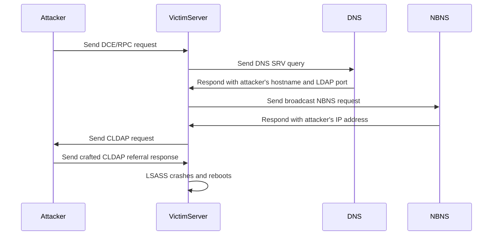

```mermaid
sequenceDiagram
    participant Attacker
    participant VictimServer
    participant DNS
    participant NBNS

    Attacker->>VictimServer: Send DCE/RPC request
    VictimServer->>DNS: Send DNS SRV query
    DNS->>VictimServer: Respond with attacker's hostname and LDAP port
    VictimServer->>NBNS: Send broadcast NBNS request
    NBNS->>VictimServer: Respond with attacker's IP address
    VictimServer->>Attacker: Send CLDAP request
    Attacker->>VictimServer: Send crafted CLDAP referral response
    VictimServer->>VictimServer: LSASS crashes and reboots
```
